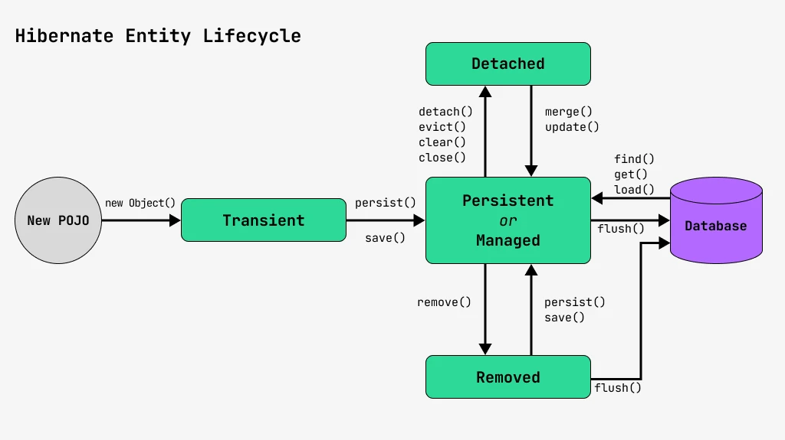

# Lesson 1

JPA is specification,  this means that it bunch of papers and the appropriate jar as library


Each of JPA vendor implicitly had transient dependency of `jakarta.persistence-api`

We are building our code via  annotations from `jakarta.persistence.*`,  and via special mechanism
[Service Provider Interface](https://dou.ua/forums/topic/43426/) in runtime, implementation appears


Each entity should have @Entity and empty constructor.
Should be existed [persistence.xml](src/main/resources/META-INF/persistence.xml) in resources/META-INF, which determine
- persistence-unit(s), which in turn determine 
  - datasource, like url, username, password
  - classes, that this unit manage

We can have multiple persistence-units for multiple date-groups

**Simple working** 

```java
    try (EntityManagerFactory emf = 
            Persistence.createEntityManagerFactory("maipu")) {
        EntityManager em = emf.createEntityManager();
        em.getTransaction().begin();
        Employee employee = new Employee("Leonid", "Kharin", 2);
        em.persist(employee);

        em.getTransaction().commit();
        em.close();
    }
```


from interesting, we have several properties in persistence.xml to set up schema
```xml
<property name="hibernate.hbm2ddl.auto" value="create"/>
<property name= "jakarta.persistence.schema-generation.database.action" value="drop-and-create"/>
```


# Lesson 2 

Each entity managed by EntityManager, entity has events during livecycle: 
- persisting (insert)
- updating
- removing
- loading (select)

Depends on these events(stages), we can say about this entity `managed` or `detached`



mappedBy переводится как отражён
Если мы делаем связь OneToOne, то только у одной стороны должен быть FK, если будет у обоих - это worst practice

Для этого, на обе стороны кидаем @OneToOne, а к НЕ ВЛАДЕЛЬЦУ кидаем "mappedBy = не владелец"


# Lesson 3 

Working with spring.

Because in Spring we not implement EntityManager by hand, container should do it for us.

For give opportunities to do it, we must
1) add `spring-orm` dependency, to add `@EnableTransactionManagement`
2) use EntityManager, via 
```java
@PersistenceContext
EntityManager em;

// or 
EntityManager em;
@PersistenceContext
public void setEm(EntityManager em) {
  this.em = em;
}
```
3) Use `@Transaction` instead of manually transaction handling (`em.getTransaction().begin()`)
4) Configure two beans
```java
@Bean
public LocalContainerEntityManagerFactoryBean entityManagerFactory() {
    var emf = new LocalContainerEntityManagerFactoryBean();
    emf.setPersistenceUnitName("maipu");
    emf.setPersistenceProviderClass(HibernatePersistenceProvider.class);
    return emf;
}

@Bean
public PlatformTransactionManager transactionManager(EntityManagerFactory emf) {
    return new JpaTransactionManager(emf);
}
```


5) Is it necessary to have a `persistence.xml` file ?
No, but in this case you also need to configure one more bean `DataSource`

```java
@Bean
public DataSource dataSource() {
    DriverManagerDataSource dataSource = new DriverManagerDataSource();
    dataSource.setDriverClassName("org.h2.Driver");
    dataSource.setUrl("jdbc:h2:./data/data");
    dataSource.setUsername("sa");
    dataSource.setPassword("");
    return dataSource;
}

@Bean
public LocalContainerEntityManagerFactoryBean entityManagerFactory(DataSource dataSource) {
    LocalContainerEntityManagerFactoryBean emf = new LocalContainerEntityManagerFactoryBean();
    emf.setDataSource(dataSource);
    emf.setPackagesToScan("com.epam.team5.model");
    emf.setPersistenceProviderClass(HibernatePersistenceProvider.class);

    // Настройка Hibernate
    emf.getJpaPropertyMap().put("hibernate.hbm2ddl.auto", "create");
    emf.getJpaPropertyMap().put("hibernate.dialect", "org.hibernate.dialect.H2Dialect");
    emf.getJpaPropertyMap().put("hibernate.show_sql", true);

    return emf;
}
```