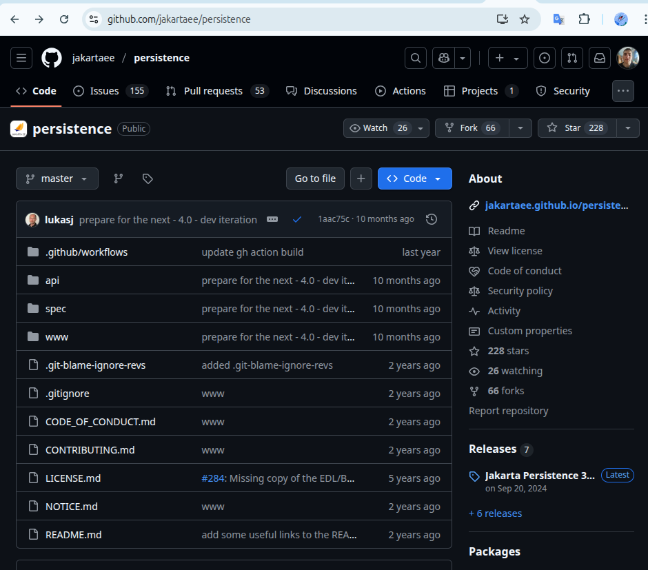

JPA is specification,  this means that it bunch of papers and the appropriate jar as library



Each of JPA vendor implicitly had transient dependency of `jakarta.persistence-api`

We are building our code via  annotations from `jakarta.persistence.*`,  and via special mechanism
[Service Provider Interface](https://dou.ua/forums/topic/43426/) in runtime, implementation appears


Each entity should have @Entity and empty constructor.
Should be existed [persistence.xml](src/main/resources/META-INF/persistence.xml) in resources/META-INF, which determine
- persistence-unit(s), which in turn determine 
  - datasource, like url, username, password
  - classes, that this unit manage

We can have multiple persistence-units for multiple date-groups

**Simple working** 

```java
    try (EntityManagerFactory emf = 
            Persistence.createEntityManagerFactory("maipu")) {
        EntityManager em = emf.createEntityManager();
        em.getTransaction().begin();
        Employee employee = new Employee("Leonid", "Kharin", 2);
        em.persist(employee);

        em.getTransaction().commit();
        em.close();
    }
```


from interesting, we have several properties in persistence.xml to set up schema
```xml
<property name="hibernate.hbm2ddl.auto" value="create"/>
<property name= "jakarta.persistence.schema-generation.database.action" value="drop-and-create"/>
```

